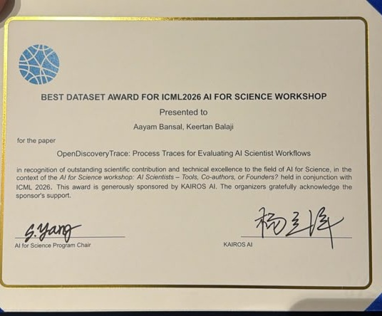

<div align="center">

# OpenDiscoveryTrace

**Process Traces for Evaluating AI Scientist Workflows**

[](https://ai4sciencecommunity.github.io/icml26/schedule)
[](https://ai4sciencecommunity.github.io/icml26/schedule)
[](https://openreview.net/forum?id=EHT3wVhCUZ)
[](https://huggingface.co/datasets/aayambansall/OpenDiscoveryTrace)
[](https://creativecommons.org/licenses/by/4.0/)

🏆 **Best Dataset Award** — ICML 2026 Workshop on AI for Science: *AI Scientists – Tools, Co-authors, or Founders?* (Dataset Proposal Competition)

🎤 **Oral presentation** — Dataset & AI Scientist Highlights, Block 1 · Saturday, July 11, 2026 · 10:30–10:50 KST · Hall C, ICML 2026

📄 **Paper:** [openreview.net/forum?id=EHT3wVhCUZ](https://openreview.net/forum?id=EHT3wVhCUZ)

🤗 **Dataset:** [huggingface.co/datasets/aayambansall/OpenDiscoveryTrace](https://huggingface.co/datasets/aayambansall/OpenDiscoveryTrace)

</div>

---

## Overview

Existing benchmarks for AI scientific agents evaluate only final outputs. OpenDiscoveryTrace captures the **full reasoning process** — every thought, tool call, error, revision, and confidence estimate — as models work through scientific tasks.

**558 trajectories** across **7 models** (3 frontier, 4 open-weight), **124 tasks** in 4 science domains (drug discovery, materials science, genomics, scientific literature analysis).

### Headline Result

On 363 LLM-judged frontier trajectories, all three frontier models achieve comparable success rates (GPT-5.4: 88.6%, Gemini 3.1 Pro: 89.3%, Claude Opus 4.6: 83.9%), yet Claude Opus 4.6 makes **30× more errors** than GPT-5.4 (2.5 vs. 0.08 per trajectory, *p* < 10⁻⁴, Cliff's δ = 0.613). The error profiles are qualitatively different: 66.7% tool misuse for Claude versus 83.6% reasoning errors for GPT-5.4. Output-only benchmarks miss this entirely.

---

## Links

| Resource | Link |
|----------|------|
| Paper (OpenReview) | [openreview.net/forum?id=EHT3wVhCUZ](https://openreview.net/forum?id=EHT3wVhCUZ) |
| Paper (PDF in this repo) | [`paper/paper.pdf`](paper/paper.pdf) · [full-length version](paper/supplementary/paper_full_version.pdf) |
| Full dataset (HuggingFace) | [huggingface.co/datasets/aayambansall/OpenDiscoveryTrace](https://huggingface.co/datasets/aayambansall/OpenDiscoveryTrace) |
| Workshop | [AI Scientists – Tools, Co-authors, or Founders? @ ICML 2026](https://ai4sciencecommunity.github.io/icml26) |
| Workshop schedule | [ai4sciencecommunity.github.io/icml26/schedule](https://ai4sciencecommunity.github.io/icml26/schedule) |
| Dataset Proposal Competition | [ai4sciencecommunity.github.io/icml26/dataset](https://ai4sciencecommunity.github.io/icml26/dataset) |
| ICML virtual page | [icml.cc/virtual/2026/workshop/54099](https://icml.cc/virtual/2026/workshop/54099) |

---

## Repository Structure

```
OpenDiscoveryTrace/
│
├── paper/                          # Submission
│   ├── paper.pdf                   #   Competition proposal (2pp + appendix)
│   ├── paper.tex                   #   LaTeX source
│   ├── references.bib              #   Bibliography
│   ├── table_comparison.tex        #   Benchmark comparison table
│   ├── figures/                    #   Figures used in paper
│   └── supplementary/              #   Full-length analysis paper
│
├── src/
│   ├── harness/                    # Trajectory generation
│   │   ├── agent_harness.py        #   Main harness: runs models through tasks
│   │   └── run_opensource.py       #   Open-weight model runner (local GPU)
│   ├── analysis/                   # Analysis pipelines
│   │   ├── analyze_trajectories.py #   Core stats + figures
│   │   └── reviewer_analysis.py    #   Extended analysis (taxonomy, baselines)
│   └── baselines/                  # Benchmark task baselines
│       └── implement_four.py       #   IAA, sequence models, live retrieval
│
├── data/
│   ├── task_bank.json              # 200 scientific tasks (124 executed)
│   └── samples/                    # Sample trajectories (full set on HuggingFace)
│       ├── frontier/               #   3 tasks × 3 frontier models
│       └── open_weight/            #   1 task × Qwen2.5-1.5B
│
├── results/
│   ├── statistics/                 # Raw analysis outputs (JSON)
│   │   ├── analysis_results.json
│   │   ├── reviewer_analysis_results.json
│   │   └── four_additions_results.json
│   └── figures/                    # All generated figures (PDF)
│
├── research_notes/                 # Research process documentation
│   ├── literature-review.md        #   60+ papers across 5 facets
│   ├── reasoning.md                #   Hypothesis deliberation
│   ├── methodology.md              #   Pre-analysis plan
│   └── synthesis.md                #   Results interpretation
│
├── assets/                         # Award certificate
├── LICENSE                         # CC-BY-4.0
├── requirements.txt
└── README.md
```

---

## Quick Start

### Browse a trajectory

```python
import json

with open("data/samples/frontier/dd_e01_gpt-5.4.json") as f:
    traj = json.load(f)

print(f"Task:    {traj['prompt'][:80]}...")
print(f"Model:   {traj['model']}")
print(f"Steps:   {traj['metadata']['total_steps']}")
print(f"Errors:  {traj['metadata']['total_failures']}")
print(f"Claim:   {traj['outcome']['final_claim'][:120]}...")
```

### Run analysis

```bash
pip install -r requirements.txt
python src/analysis/analyze_trajectories.py
```

### Generate new trajectories

```bash
# Frontier models (requires OPENAI_API_KEY / ANTHROPIC_API_KEY / GEMINI_API_KEY)
python src/harness/agent_harness.py --model gpt-5.4 --max-tasks 10

# Open-weight models (requires GPU, no API keys)
python src/harness/run_opensource.py
```

---

## Trace Schema

Each step in a trajectory records 9 fields:

| Field | Description |
|-------|-------------|
| `step_id` | Sequential step index |
| `timestamp` | ISO 8601 UTC |
| `phase` | Scientific workflow phase (literature review → hypothesis → experiment → execution → analysis → conclusion) |
| `thought` | Model's reasoning |
| `action` | Tool call details (type, tool name, input, output) |
| `observation` | Processed result of the action |
| `error` | Error state (occurred, type, message) |
| `revision_trigger` | What prompted a strategy change |
| `confidence` | Self-reported certainty \[0, 1\] |

Full JSON schema in [`paper/paper.tex`](paper/paper.tex) Appendix A.

---

## Models

| Model | Type | Trajectories |
|-------|------|-------------|
| GPT-5.4 | Frontier | 124 |
| Claude Opus 4.6 | Frontier | 124 |
| Gemini 3.1 Pro | Frontier | 124 |
| Qwen2.5-7B-Instruct | Open-weight (single-response) | 30 |
| Mistral-7B-v0.3 | Open-weight (single-response) | 30 |
| Phi-3.5-mini-instruct | Open-weight (single-response) | 30 |
| Qwen2.5-1.5B-Instruct | Open-weight (single-response) | 30 |
| Qwen2.5-7B-Instruct | Open-weight (tool-scaffolded, full multi-step harness) | 6 |
| Frontier models | Live-retrieval variants (PubMed / PubChem) | 60 |
| **Total** | | **558** |

Frontier trajectories are fully balanced across 4 domains × 3 difficulty levels.

---

## Benchmark Tasks

1. **Trajectory Outcome Prediction** — predict success from step features
2. **Error Localization** — identify the step where reasoning went wrong
3. **Claim Verification** — verify correctness of final claims
4. **Autonomy Classification** — classify L1–L4 autonomy levels
5. **Process Quality Scoring** — multi-axis trajectory quality

Baselines (logistic regression, random forest, LSTM, Transformer) in [`results/statistics/`](results/statistics/) and Appendix H of the paper.

---

## Full Dataset

Sample trajectories are included in `data/samples/`. The complete dataset is hosted on HuggingFace:

**[huggingface.co/datasets/aayambansall/OpenDiscoveryTrace](https://huggingface.co/datasets/aayambansall/OpenDiscoveryTrace)**

---

## License

Code, data, and paper are released under [CC-BY-4.0](https://creativecommons.org/licenses/by/4.0/). See [`LICENSE`](LICENSE).

---

## Citation

```bibtex
@inproceedings{bansal2026opendiscoverytrace,
  title     = {OpenDiscoveryTrace: Process Traces for Evaluating
               AI Scientist Workflows},
  author    = {Bansal, Aayam and Balaji, Keertan},
  booktitle = {ICML 2026 Workshop on AI for Science: AI Scientists --
               Tools, Co-authors, or Founders?},
  year      = {2026},
  url       = {https://openreview.net/forum?id=EHT3wVhCUZ},
  note      = {Best Dataset Award, Dataset Proposal Competition}
}
```

---

## Best Dataset Award

<p align="center">
  
</p>

<p align="center"><em>Best Dataset Award, ICML 2026 AI for Science Workshop.</em></p>
